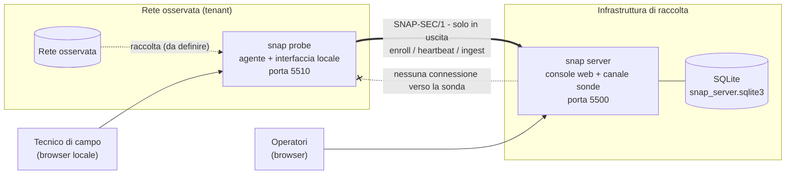
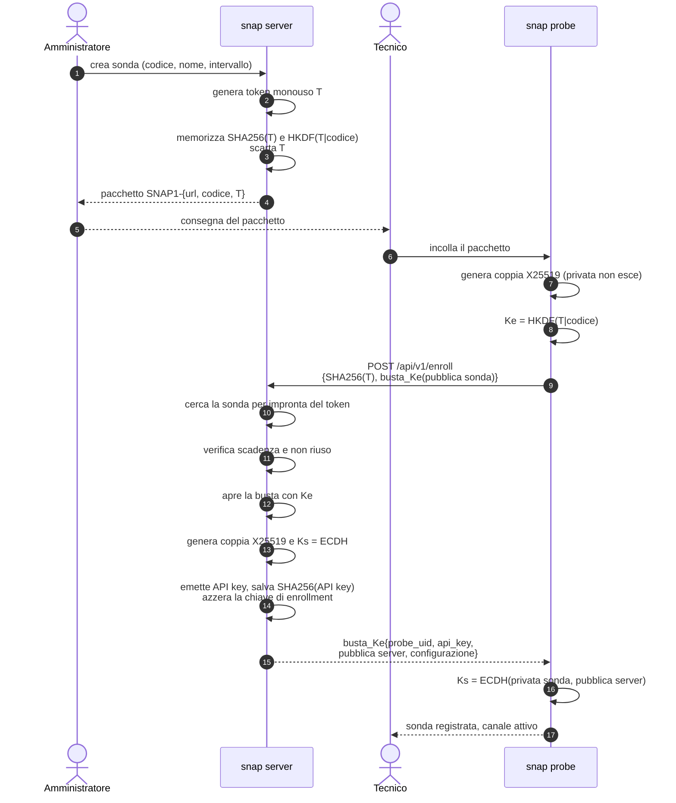
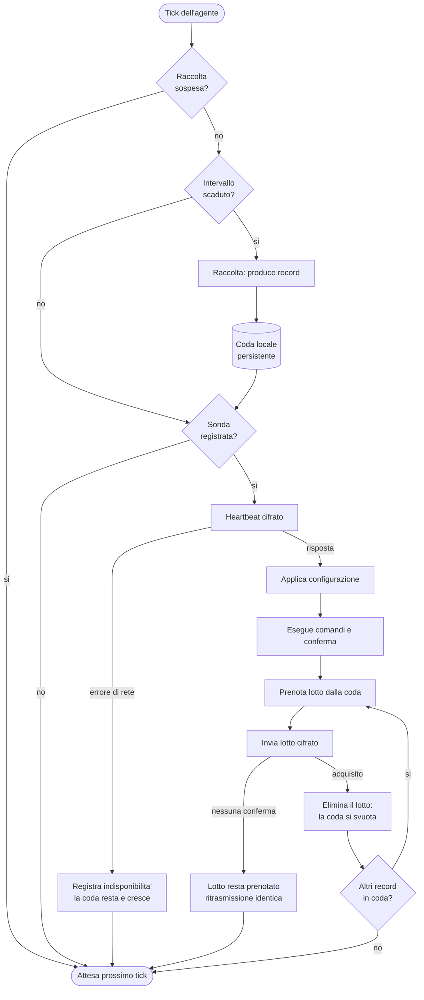
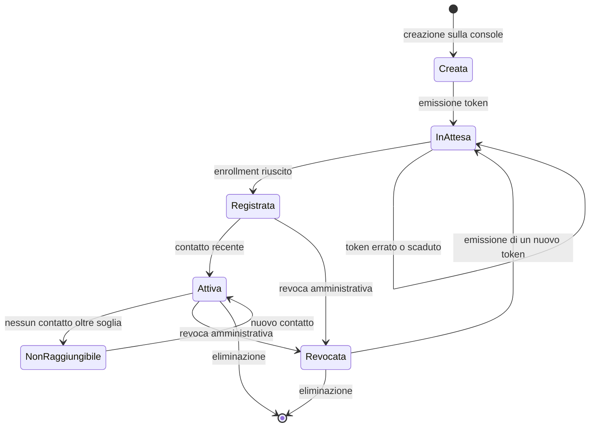
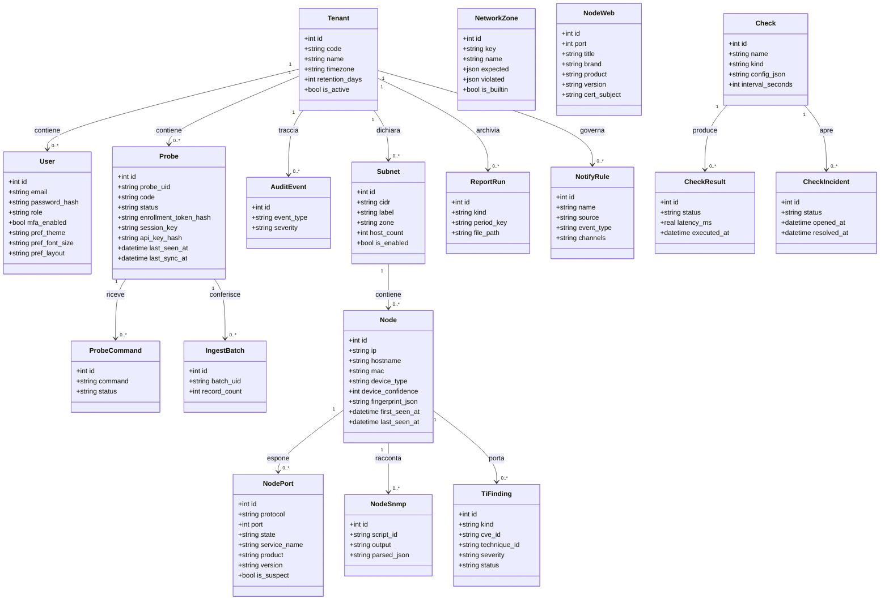
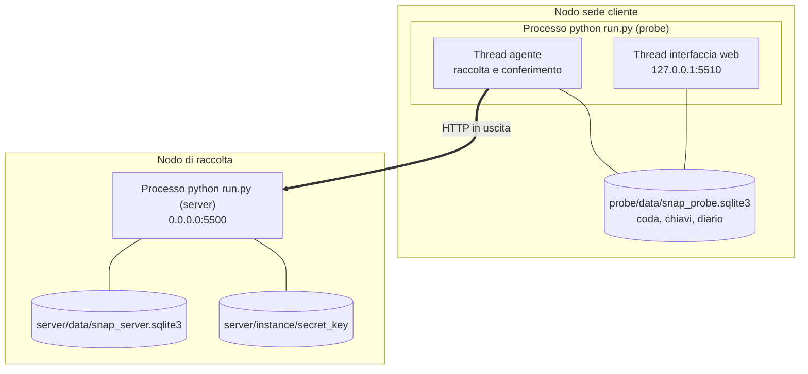

<!--
  snap - Documento di architettura.
  Notazione dei diagrammi conforme a ISO/IEC/IEEE 19510:2013 (UML/BPMN) resa in Mermaid.

  remarks: Autore: Daniele Speziale - Data: 2026-08-26
  copyright: (c) 2024-26 DS Consulting
  license: MIT
-->

# snap - Documento di architettura

| Voce | Valore |
|---|---|
| Sistema | snap - Secure Network Assessment Platform |
| Versione | 1.1.0 |
| Data | 2026-08-27 |
| Autore | Daniele Speziale |
| Standard | ISO/IEC/IEEE 19510:2013 (modellazione), ISO/IEC/IEEE 15288:2015 (processi) |

---

## 1. Principi architetturali

1. **Asimmetria della conoscenza.** La sonda conosce il server; il server non
   conosce la sonda. Il server memorizza soltanto l'identita' logica della sonda
   e il materiale crittografico necessario a riconoscerla: non conserva
   indirizzi, nomi di rete o percorsi che consentano di raggiungerla.
2. **Traffico unidirezionale.** Tutte le connessioni sono aperte dalla sonda.
   Nessuna porta in ingresso deve essere aperta sulla rete osservata.
3. **Separazione fisica dei componenti.** `server/` e `probe/` sono due
   applicativi distinti, senza codice condiviso; il protocollo e' l'unico
   contratto fra loro. Il modulo crittografico e' implementato due volte, in modo
   indipendente e speculare.
4. **Isolamento multi-tenant per costruzione.** Ogni entita' di dominio porta
   `tenant_id`; l'accesso avviene sempre passando esplicitamente il tenant
   corrente.
5. **Tempo unico, presentazione locale.** Persistenza in UTC, conversione al fuso
   del tenant solo in presentazione. La regola vale per entrambi gli applicativi:
   la sonda riceve il fuso del tenant in registrazione e lo usa nella propria
   interfaccia, dichiarandolo; vale anche per le aggregazioni per giorno, i cui
   confini dipendono dal fuso e dall'ora legale.
6. **Autonomia della sonda.** L'assenza del server e' una condizione ordinaria,
   non un guasto: la sonda continua a lavorare e accumula.

---

## 2. Vista di contesto

---

## 3. Vista dei componenti

```mermaid
graph TB
    subgraph SERVER["snap server (server/snapserver/)"]
        direction TB
        subgraph PAGINE["blueprints (pagine e API)"]
            A1["auth<br/>accesso, MFA, preferenze"]
            A2["dashboard<br/>sintesi e indicatori"]
            A3["inventory<br/>nodi, perimetro, mappa, conferimenti"]
            A4["monitor<br/>stato della rete e cambiamenti"]
            A5["probes<br/>flotta, token, comandi"]
            A6["checks<br/>bersagli, controlli, incidenti, metriche"]
            A7["reports<br/>catalogo e archivio dei PDF"]
            A8["rules_views<br/>regole di notifica"]
            A9["threat<br/>CVE, CWE, ATT&CK, riscontri"]
            A10["operations<br/>quadro NOC, quadro SOC, ricerca"]
            A11["admin<br/>tenant, utenti, impostazioni, manutenzione"]
            A12["audit_views<br/>registro eventi"]
            A13["guide<br/>guida in linea"]
            A14["api_probe<br/>CANALE SONDE"]
        end
        subgraph DOMINIO["moduli di dominio"]
            C1["security<br/>password, ruoli, TOTP"]
            C2["tenancy<br/>contesto tenant, fusi, formati"]
            C3["queries / inventory_queries /<br/>checks_queries<br/>letture aggregate"]
            C4["ingest<br/>applicazione dei lotti conferiti"]
            C5["crypto<br/>X25519 / HKDF / AES-GCM"]
            C6["audit<br/>registro eventi"]
            C7["fingerprint<br/>riconoscimento dei dispositivi"]
            C8["checks<br/>definizione, esiti, incidenti"]
            C9["threat + threat_sources<br/>catalogo e correlazione"]
            C10["snmp_tables<br/>letture SNMP in tabella"]
            C11["operations + searchdb<br/>sale operative e ricerca"]
            C16["zones + zone_admin<br/>contesto delle subnet"]
            C17["web_probe + web_facts + ipp_probe (sonda)<br/>navigazione, fatti, IPP"]
            C18["node_json<br/>dato grezzo di un nodo"]
            C19["rielabora<br/>riapplica ai dati raccolti"]
            C12["rules + events<br/>motore delle regole"]
            C13["notifications + channels<br/>posta e Telegram"]
            C14["reports/*<br/>dataset, resa PDF, archivio, resoconto"]
            C15["maintenance<br/>retention, copie, ripristino"]
        end
        E1["static/js<br/>snap-tables (DataTables)<br/>snap-dialogs (AWN)<br/>snap-grafici (SVG)"]
        D1["db + schema.sql<br/>SQLite / PostgreSQL"]
    end

    subgraph PROBE["snap probe (probe/snapprobe/)"]
        direction TB
        B1["views<br/>stato, registrazione, configurazione"]
        B2["agent<br/>ciclo autonomo"]
        B3["scanner + nmap_runner + nmap_xml<br/>scansione progressiva"]
        B4["checker<br/>esecuzione dei controlli"]
        B5["client<br/>trasporto SNAP-SEC/1"]
        B6["crypto<br/>implementazione indipendente"]
        B7["store<br/>SQLite locale: coda, chiavi, diario"]
    end

    A2 --> C3
    A3 --> C3
    A3 --> C7
    A4 --> C3
    A6 --> C8
    A7 --> C14
    A8 --> C12
    A9 --> C9
    A10 --> C11
    A11 --> C15
    A12 --> C6
    A14 --> C5
    A14 --> C4
    C4 --> C7
    C4 --> D1
    C9 --> C10
    C11 --> C3
    C11 --> C9
    C12 --> C13
    C14 --> C3
    C3 --> D1
    C6 --> D1

    B2 --> B3
    B2 --> B4
    B2 --> B5
    B3 --> B7
    B5 --> B6
    B5 --> B7

    B5 == "HTTP + busta cifrata" ==> A14
```

**Come leggere il disegno.** Le pagine non parlano con la banca dati: passano dai
moduli di dominio, che sono l'unico posto in cui si scrive SQL. Il canale delle sonde
(`api_probe`) e' l'unico ingresso dall'esterno, ed e' anche l'unico componente che usa
la crittografia di trasporto. La sala operativa (`operations`, `searchdb`) e' fatta di
sole letture: non scrive nulla e non contatta nessuno. Il modulo `zones` non ha stato ne' banca dati: e' un catalogo dichiarato e tre funzioni pure, interrogate dalla correlazione
(`threat`) e dalle letture dell'inventario. Un giudizio che dipendesse da una tabella modificabile a caldo non sarebbe riproducibile a distanza di mesi, che e' cio' che un report deve essere.

**Che cosa esce verso internet.** Un solo componente: `threat_sources`, quando
l'operatore chiede di aggiornare il catalogo delle vulnerabilita'. Chiede CVE per nome
di prodotto e non trasmette nulla del cliente. Tutto il resto -- correlazione,
reportistica, sale operative -- funziona in una rete isolata.

---

## 4. Vista dinamica

### 4.1 Registrazione della sonda (diagramma di sequenza UML)

### 4.2 Ciclo autonomo della sonda (diagramma di attivita')

### 4.3 Stati di una sonda (diagramma di stato UML)

---

## 5. Modello dei dati (diagramma di classi UML)

Tutte le relazioni verso `Tenant` sono in cascata sulla cancellazione: la
rimozione di un tenant elimina integralmente i suoi dati.

**Tabelle non rappresentate**, per non appesantire il disegno: `monitor_samples`
(raggiungibilita' e latenza dei nodi), `node_changes` (variazioni con prima e dopo),
`check_metrics` (misure ricavate dagli esiti), `rule_matches` (corrispondenze delle
regole), `notifications` (coda di spedizione, posta e Telegram), `event_cursors`
(fin dove il motore delle regole ha letto ciascuna sorgente), `scan_runs` (diario
delle scansioni) e il catalogo comune della threat intelligence -- `ti_cve`,
`ti_cve_cpe`, `ti_cve_cwe`, `ti_cwe`, `ti_technique`, `ti_sync` -- che non appartiene
ad alcun tenant perche' descrive il mondo, non il cliente.

---

## 6. Vista di distribuzione (deployment)

**Note di esercizio**

- L'interfaccia della sonda ascolta per impostazione predefinita su `127.0.0.1`:
  non e' un servizio esposto in rete.
- Il server puo' essere pubblicato su indirizzo raggiungibile dalle sonde; il
  valore da comunicare nei pacchetti di registrazione si configura in
  *Impostazioni Sistema > Indirizzo pubblico del server*.
- Le porte utilizzabili sono comprese fra 5500 e 5600 (vincolo NFR-06).

---

## 7. Decisioni architetturali

| ID | Decisione | Alternative valutate | Motivazione |
|---|---|---|---|
| AD-01 | Cifratura applicativa end-to-end (X25519 + AES-256-GCM) | Solo TLS con certificato self-signed; TLS + cifratura applicativa | Nessun certificato da distribuire e mantenere; il payload resta protetto anche attraverso proxy intermedi; possibile aggiungere TLS come strato esterno senza modifiche |
| AD-02 | SQLite con SQL esplicito, senza ORM | ORM (SQLAlchemy) | Il filtro `tenant_id` resta visibile in ogni istruzione, elemento centrale del requisito di isolamento; nessuna dipendenza aggiuntiva; installazione senza servizi esterni |
| AD-03 | Modulo crittografico duplicato nei due applicativi | Libreria comune condivisa | Le due parti sono distribuite separatamente (requisito di separazione completa); l'interoperabilita' e' verificata da test dedicati |
| AD-04 | Comandi in piggyback sulle risposte | Canale di controllo verso la sonda (WebSocket, polling inverso) | Preserva l'asimmetria della conoscenza e l'assenza di porte in ingresso |
| AD-05 | Coda locale con prenotazione del lotto | Invio diretto senza prenotazione | Consente ritrasmissione idempotente e svuotamento solo dopo conferma, evitando sia perdite sia duplicazioni |
| AD-06 | Risorse dell'interfaccia servite localmente | Distribuzione via CDN | Funzionamento in reti prive di accesso a Internet; versione delle librerie stabile e verificabile |
| AD-07 | Agente in thread interno al processo dell'interfaccia | Servizio separato o pianificatore di sistema | Un solo processo da avviare e sorvegliare; modalita' non presidiata disponibile con `--headless` |
| AD-08 | Presentazione oraria calcolata a ogni richiesta | Conversione al momento della scrittura | Il cambio di fuso del tenant si riflette immediatamente sui dati storici |
| AD-13 | Cookie di sessione inviato solo quando la sessione cambia; i file statici non aprono il contesto di sessione | Rinnovo del cookie a ogni risposta (comportamento predefinito di Flask) | Una pagina carica diversi file statici in parallelo: ogni risposta che tocca la sessione ne riscrive il cookie e una risposta tardiva puo' sovrascrivere lo stato piu' recente, con perdita intermittente dell'accesso |
| AD-14 | Nome del cookie di sessione distinto per applicativo (`snap_server_session`, `snap_probe_session`) | Nome predefinito di Flask (`session`) per entrambi; percorso del cookie distinto; nomi host distinti | I cookie sono definiti per dominio e **non distinguono la porta**: con lo stesso nome su `127.0.0.1` la risposta della sonda sovrascrive il cookie del server (e viceversa), invalidando la sessione dell'altra interfaccia. Il nome resta configurabile con `SNAP_SERVER_COOKIE_NAME` e `SNAP_PROBE_COOKIE_NAME` |
| AD-15a | Il contesto di rete e' un **dato del tenant** (`network_zones`), con il catalogo del prodotto come seme; il *significato* dei giudizi resta nel codice (`zones.py`, `threat.EXPOSURE_RULES`) | Catalogo chiuso nel codice (AD-15, superata); zone completamente libere, famiglie comprese | Le zone sono un fatto della rete del cliente e vanno dichiarate da lui; le famiglie di esposizione sono regole di prodotto, e una famiglia inventata sembrerebbe attiva senza fare nulla. La riga sotto resta come storia della decisione |
| AD-15 | ~~Il contesto di rete e' un catalogo nel codice~~ (superata da AD-15a) | Zone definite dall'utente con regole proprie; nessun contesto | Le regole di giudizio sono codice: una zona creata a mano sarebbe una stringa senza regole, e sembrerebbe funzionare. La sola cosa che il cliente dichiara e' *quale* zona vale per quale subnet, che e' un dato; il *significato* di ciascuna zona e' prodotto, ed e' versionato con esso |
| AD-12 | Contratto di conferimento con un registro di tipi di record estensibile (`_APPLICATORI`) | Schema fisso per ciascun tipo di dato | I tipi di dato raccolti verranno definiti successivamente: il trasporto cifrato resta invariato e l'aggiunta di un tipo richiede un solo applicatore sul server e un generatore sulla sonda |
| AD-10 | Tabelle interattive realizzate con DataTables 3 applicato alla tabella HTML prodotta dal server | Griglia alimentata via JSON; altre librerie di tabella | Il contenuto resta leggibile anche senza JavaScript; DataTables 3 non richiede jQuery, si integra con Bootstrap 5 tramite il tema ufficiale ed e' la libreria richiesta dal committente |
| AD-11 | Impaginazione lato client con finestra ampia servita dal server e navigazione server-side residua | Impaginazione, ordinamento e ricerca interamente remoti | Ordinamento e ricerca operano sull'insieme completo dei dati, senza andirivieni verso il server; la navigazione remota resta come argine sui volumi elevati |
