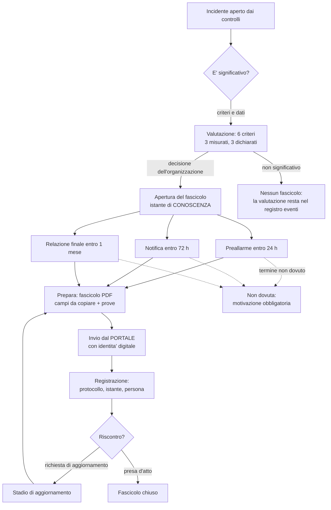

# 13. Comunicazione degli incidenti all'ACN

**Documento conforme a**: ISO/IEC/IEEE 29148:2018 (requisiti, §3), ISO/IEC/IEEE 15288
(processi del ciclo di vita, §1 e §6), ISO/IEC 19510 (BPMN) per il diagramma del
percorso (§4).

**Quadro normativo**: art. 23 della **direttiva (UE) 2022/2555 (NIS2)**, recepita in
Italia dal **D.lgs. 138/2024**; art. 33 del **regolamento (UE) 2016/679 (GDPR)** per la
notifica al Garante, che e' un obbligo distinto; **linee guida ACN** sulla notifica
degli incidenti.

---

## 1. Portata

Il percorso che porta da un incidente rilevato dai controlli a una comunicazione
registrata verso l'Agenzia per la Cybersicurezza Nazionale, con i suoi termini e le sue
prove. Riguarda i soggetti che ricadono nell'ambito NIS2 e sono registrati sul portale
delle segnalazioni.

**Fuori portata**: la registrazione del soggetto presso ACN, la designazione del punto
di contatto, la qualificazione come soggetto essenziale o importante. Sono atti
amministrativi che precedono l'uso del prodotto.

---

## 2. Il vincolo da cui parte il progetto

Il portale `https://segnalazioni.acn.gov.it/` e' un'applicazione web ad accesso
**autenticato con identita' digitale** (SPID, CIE, CNS), riservata al punto di contatto
designato dal soggetto registrato. **Non espone un'interfaccia di programmazione
pubblica per l'invio automatico.**

Quindi snap **prepara e sorveglia, non invia**. Non e' una limitazione da aggirare, ed
evitarla sarebbe sbagliato in tre modi:

| perche' no | conseguenza |
|---|---|
| **credenziali** | automatizzare l'accesso richiederebbe di conservare l'identita' digitale di una persona. Non si fa, e nessuna comodita' lo giustifica |
| **imputabilita'** | la notifica e' un atto di una persona identificata. Un programma che la invia al posto suo attribuisce a quella persona un atto che non ha compiuto |
| **fragilita'** | un robot che compila i moduli di un portale della pubblica amministrazione si rompe al primo cambio di pagina, e si rompe nel momento peggiore: quando c'e' un incidente in corso e le ore contano |

Il canale e' comunque un'**astrazione** (`acn.CANALI`): la voce per un'eventuale
interfaccia di programmazione esiste e dichiara di non essere disponibile. Se ACN la
pubblichera', si aggiunge un canale e il percorso non cambia.

---

## 3. Requisiti

| id | requisito | verifica |
|---|---|---|
| AC-01 | Il prodotto non deve conservare credenziali di accesso al portale ne' tentare l'invio automatico. | `test_nel_prodotto_non_ci_sono_credenziali_del_portale` |
| AC-02 | I termini devono decorrere dall'istante di **conoscenza** dell'incidente, dichiarato dall'operatore. | `test_i_termini_decorrono_dalla_conoscenza` |
| AC-03 | Devono essere previsti gli stadi preallarme (24 h), notifica (72 h), aggiornamento (su richiesta) e relazione finale (1 mese). | `test_aprire_il_fascicolo_crea_gli_stadi_con_le_scadenze` |
| AC-04 | Lo stato di una comunicazione deve poter diventare "inviata" solo con il numero di protocollo restituito dal portale. | `test_l_invio_richiede_il_protocollo` |
| AC-05 | Una comunicazione dichiarata non dovuta deve richiedere una motivazione e restare nell'elenco. | `test_una_comunicazione_non_dovuta_richiede_la_motivazione` |
| AC-06 | La valutazione di significativita' deve essere presentata come proposta, con i criteri non misurabili dichiarati come tali. | `test_la_valutazione_e_una_proposta_non_un_verdetto` |
| AC-07 | Il prodotto deve avvisare prima della scadenza di un termine e una volta a termine superato, senza ripetere. | `test_la_sorveglianza_avvisa_una_volta_sola` |
| AC-08 | Gli avvisi sui termini non devono essere disattivabili dal filtro dei momenti di notifica. | `test_i_momenti_degli_avvisi_non_sono_filtrabili` |
| AC-09 | Deve essere possibile produrre un fascicolo PDF con i campi da compilare e le prove da allegare. | `test_il_fascicolo_pdf_si_scarica_e_porta_i_campi` |
| AC-10 | Il percorso deve essere riservato all'amministratore del tenant. | `test_un_analista_non_comunica_all_autorita` |
| AC-11 | Il registro delle comunicazioni deve comparire nel fascicolo di conformita' e nel fascicolo europeo come prova dell'art. 23. | `test_il_registro_conta_cio_che_un_ispettore_chiede` |
| AC-12 | Deve essere possibile registrare a mano un incidente da valutare, con titolo, soggetto, gravita' e istante di conoscenza. | `test_si_registra_un_incidente_che_non_nasce_da_un_controllo` |
| AC-13 | Un incidente registrato a mano deve poter essere eliminato; uno aperto da un controllo no. | `test_un_incidente_aperto_da_un_controllo_non_si_elimina` |
| AC-14 | L'eliminazione deve essere rifiutata se una comunicazione e' stata inviata all'autorita'. | `test_un_incidente_gia_comunicato_non_si_elimina` |

---

## 4. Il percorso

### 4.0 Da dove arriva un incidente

Due origini, e la differenza conta:

| origine | chi lo apre | si elimina? |
|---|---|---|
| **da un controllo** | un controllo che fallisce oltre la soglia | **no**: e' un fatto della storia della sorveglianza, e cancellarlo falsificherebbe il registro. Si chiude, con la sua motivazione |
| **registrato a mano** | una persona, da *Comunicazioni ACN* | **si**, finche' nessuna comunicazione e' stata inviata all'autorita' |

La registrazione manuale non e' una comodita': gli incidenti che contano di piu' non li
rileva una sonda. Li porta una telefonata di un fornitore, una segnalazione del CSIRT, un
riscatto comparso su uno schermo. Se il percorso partisse solo dai controlli, quegli
incidenti resterebbero fuori dal fascicolo -- cioe' proprio quelli per cui l'art. 23
esiste.

Si registra con: **titolo** (obbligatorio: e' cio' che si legge nell'elenco e nel
fascicolo), servizio o sistema interessato, gravita', **istante di conoscenza** (da cui
decorrono i termini, correggibile) e descrizione. Nello schema un incidente appartiene a
un controllo: gli incidenti registrati a mano vivono sotto un contenitore per tenant --
un controllo **disattivato**, che non esegue verifiche -- invece di allentare quel
vincolo in venti interrogazioni. Titolo e soggetto scritti dall'operatore vincono sul
nome del contenitore in ogni pagina e nel fascicolo.

**L'eliminazione** ha due limiti, entrambi voluti:

* un incidente aperto da un **controllo** non si elimina (vedi tabella);
* un incidente per cui una comunicazione e' stata **inviata** non si elimina: il
  protocollo restituito dal portale e' la prova dei tempi, e la prova non si cancella.
  Se l'incidente si rivela un falso allarme, lo si dichiara nella **relazione finale** --
  non facendo sparire la riga.

Eliminando un incidente si elimina anche il suo fascicolo **non ancora inviato**, e il
numero di comunicazioni tolte compare nel messaggio e nel registro degli eventi.

### 4.1 Gli stadi e i termini

| stadio | termine | che cosa contiene |
|---|---|---|
| **preallarme** | 24 ore dalla conoscenza | che e' successo un incidente significativo; se si sospetta un atto illecito o doloso; se puo' avere impatto in altri Stati membri |
| **notifica** | 72 ore dalla conoscenza | valutazione iniziale: gravita', impatto, indicatori di compromissione, aggiornamento del preallarme |
| **aggiornamento** | su richiesta dell'autorita' | cio' che si e' saputo dopo: nuove evidenze, estensione dell'impatto, misure aggiuntive |
| **relazione finale** | un mese | descrizione dettagliata, gravita' e impatto, tipo di minaccia e causa probabile, misure applicate, effetti trasfrontalieri |

I termini decorrono dalla **conoscenza** dell'incidente, non dal suo inizio: e' cio' che
dice l'art. 23 ed e' anche l'unico istante che si puo' documentare. L'operatore lo
conferma all'apertura del fascicolo e puo' correggerlo, perche' l'organizzazione puo'
essere venuta a conoscenza dopo il rilevamento tecnico.

### 4.2 Gli stati di una comunicazione

`da preparare` → `preparata` → `inviata` → `riscontro`, con `non dovuta` come esito
alternativo motivato. Le transizioni sono dichiarate (`acn.TRANSIZIONI`) per una ragione
sola: nessuno deve poter dichiarare "inviata" una comunicazione che non e' mai stata
composta.

Uno stadio **non si salta**: si dichiara non dovuto con una motivazione, e la riga resta
nell'elenco. Un elenco in cui le comunicazioni non dovute sparissero non permetterebbe
di distinguere "non serviva" da "ce ne siamo dimenticati", che e' precisamente la
domanda di un ispettore.

---

## 5. La valutazione di significativita'

La direttiva chiede di notificare gli incidenti **significativi**: quelli che causano
"una grave perturbazione operativa o perdite finanziarie" o che hanno "ripercussioni su
altri soggetti". Non e' una soglia numerica, ed e' giusto che non lo sia.

snap presenta sei criteri. **Tre li misura**:

| criterio | come si misura | soglia predefinita |
|---|---|---|
| gravita' | classificazione del controllo che ha aperto l'incidente | `critical` |
| durata | ore fra apertura e chiusura (o adesso, se aperto) | 4 ore |
| estensione | incidenti aperti contemporaneamente | 3 servizi |

**Tre restano da dichiarare**, perche' nessuna misura tecnica puo' stabilirli: sospetto
di atto illecito o doloso, effetti su altri soggetti o Stati membri, coinvolgimento di
dati personali. Sono anche i tre che pesano di piu' in una valutazione reale.

La proposta di snap non e' un verdetto: e' cio' che i dati dicono, criterio per
criterio, cosi' che chi decide lo faccia guardando qualcosa. La decisione e'
dell'organizzazione, e resta registrata.

**Dati personali**: se l'incidente li coinvolge, la notifica al Garante (GDPR art. 33,
72 ore) e' un obbligo **distinto**. Una non sostituisce l'altra, e il fascicolo lo
scrive.

---

## 6. Che cosa contiene il fascicolo

Il PDF (tema *Comunicazione ACN*, stessa grafica degli altri documenti) e' fatto per due
usi in un foglio solo:

1. **i campi da compilare** nel portale, uno per riga, pronti da copiare -- chi sta
   notificando alle tre di notte non deve cercare i dati in cinque pagine diverse;
2. **l'allegato** da caricare: cronologia dei fatti (verifiche del controllo con esito),
   valutazione di significativita' con i criteri, misure adottate dal registro eventi,
   comunicazioni interne, stato di tutti gli stadi.

I tre campi "da dichiarare" non sono lasciati vuoti per dimenticanza, e il documento lo
scrive: sono valutazioni che nessuna misura tecnica puo' stabilire.

Gli stessi campi sono a schermo nella pagina della comunicazione, perche' copiarli da
una pagina e' piu' rapido che aprire un PDF.

---

## 7. La sorveglianza dei termini

Un termine di legge che scade in silenzio e' il difetto peggiore che questa parte del
prodotto possa avere: le 24 ore del preallarme cadono di notte, di sabato, durante un
incidente che sta occupando tutti.

Un thread nel processo del server controlla ogni cinque minuti e manda **due avvisi, e
solo due**:

* **in avvicinamento**, quando restano meno di 6 ore (predefinito). Uno per
  comunicazione, non uno per giro: un avviso ripetuto ogni cinque minuti diventa rumore,
  e il rumore si silenzia;
* **termine superato**, una volta. Da quel momento la domanda non e' piu' "quando
  inviamo" ma "come lo scriviamo nel fascicolo".

I destinatari sono il recapito del tenant e gli amministratori del tenant: un secondo
elenco di recapiti da tenere aggiornato e' un elenco che invecchia, e un avviso che non
arriva e' peggio di un avviso che arriva a qualcuno in piu'.

I due momenti **non passano** dal filtro dei momenti di notifica in Amministrazione: un
termine di legge disattivato da una scelta fatta anni prima e' esattamente il modo in
cui si perde una scadenza.

---

## 8. Dove si vede

| dove | che cosa |
|---|---|
| **Sicurezza > Comunicazioni ACN** | le comunicazioni dovute dalla piu' urgente, gli incidenti aperti da valutare, il registro con i termini e il promemoria di che cosa chiede la norma |
| **Controlli > Incidenti** | accanto a ogni incidente il pulsante per la valutazione: la domanda "va comunicato?" si pone dove si vede l'incidente |
| **Fascicolo di conformita'** (report) | sezione *Comunicazioni inviate*: gli avvisi interni e, distinte, le comunicazioni all'autorita' con i termini |
| **Fascicolo europeo** (report) | prova del requisito NIS2 art. 23: quante aperte, quante inviate con protocollo, quante oltre il termine, quante da inviare |

La voce di menu e tutte le rotte sono riservate all'**amministratore del tenant**: la
comunicazione all'autorita' e' un atto che impegna il soggetto, e chi la registra
dichiara che e' avvenuta.

---

## 9. Limiti dichiarati

* **Non si invia**: l'invio e' un atto del punto di contatto sul portale, con identita'
  digitale. Il prodotto compone, sorveglia e registra.
* **La qualifica di "significativo" non e' automatica**: e' una valutazione
  dell'organizzazione. I criteri misurabili sono un aiuto, non una decisione.
* **Il protocollo si inserisce a mano**: e' il numero che il portale restituisce dopo
  l'invio, e non c'e' modo di leggerlo automaticamente.
* **Nessuna integrazione con il Garante**: la notifica GDPR art. 33 non e' gestita, ed
  e' segnalata come obbligo distinto.
* **Le soglie della valutazione sono predefinite** (4 ore, 3 servizi, gravita'
  critica): sono dichiarate nel documento e nel codice, e non pretendono di essere la
  legge.
* **Gli incidenti registrati a mano non hanno cronologia tecnica**: la sezione del fascicolo che elenca le verifiche del controllo resta vuota, e il documento lo dichiara. Le prove, per quegli incidenti, sono la descrizione e il registro degli eventi.
* **Un solo canale disponibile**: il portale. L'astrazione per un canale automatico
  esiste e dichiara di non essere disponibile.

---

## 10. Decisioni assunte

| id | decisione | perche' |
|---|---|---|
| AC-D1 | snap **non invia** al portale e non conserva identita' digitali | credenziali, imputabilita' e fragilita': vedi §2. La comodita' non giustifica nessuna delle tre |
| AC-D2 | I termini decorrono dalla **conoscenza**, dichiarata dall'operatore | e' cio' che dice l'art. 23, ed e' l'unico istante documentabile. Il rilevamento tecnico puo' precedere la conoscenza dell'organizzazione |
| AC-D3 | Lo stato "inviata" richiede il **protocollo** | senza il numero restituito dal portale la riga direbbe che la comunicazione e' partita senza poterlo dimostrare, ed e' la prima cosa che chiede un ispettore |
| AC-D4 | Una comunicazione non dovuta **resta** nell'elenco, con motivazione | distingue "non serviva" da "ce ne siamo dimenticati" |
| AC-D5 | Tutti gli stadi si creano **all'apertura** del fascicolo | un elenco che mostrasse solo il prossimo passo non permetterebbe di vedere l'obbligo nel suo insieme, e l'obbligo e' fatto di scadenze che arrivano insieme |
| AC-D6 | Gli avvisi sui termini **non sono filtrabili** | un termine di legge disattivato da una scelta di anni prima e' il modo in cui si perde una scadenza |
| AC-D7 | Il percorso e' riservato all'**amministratore del tenant** | la comunicazione impegna il soggetto: chi la registra dichiara che e' avvenuta |
| AC-D9 | Un incidente si puo' **registrare a mano**, e in quel caso si puo' eliminare | Gli incidenti che contano di piu' non li rileva una sonda. E un'operatrice che registra per errore, o che prova il percorso, deve poter tornare indietro: un elenco che non si puo' pulire smette di essere usato |
| AC-D10 | L'eliminazione si ferma davanti a una comunicazione **inviata** | Il protocollo restituito dal portale e' la prova dei tempi. Un falso allarme si dichiara nella relazione finale: e' cio' che la norma prevede, e non lascia buchi nel registro |
| AC-D8 | La valutazione di significativita' e' una **proposta** | i criteri che pesano di piu' non sono misurabili. Un prodotto che decidesse al posto dell'organizzazione le farebbe assumere un rischio che non e' suo |
